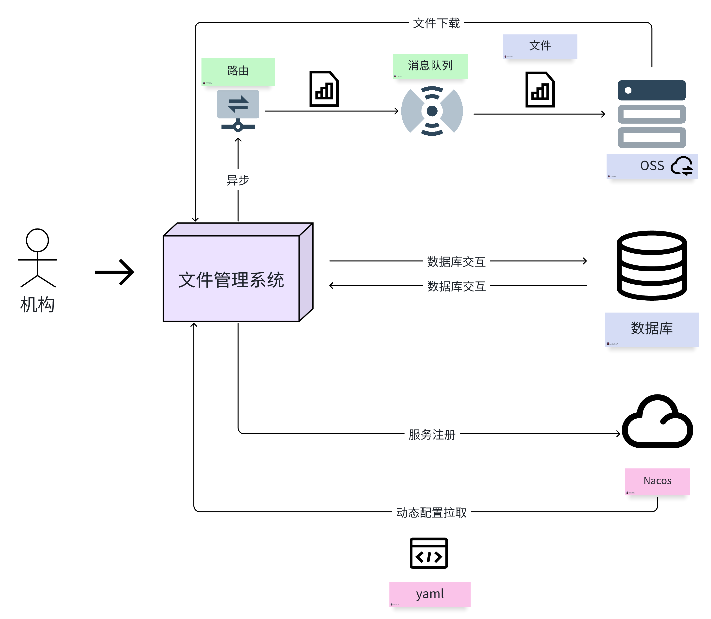
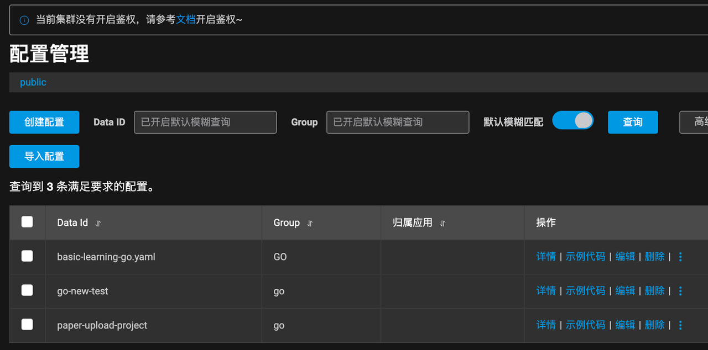
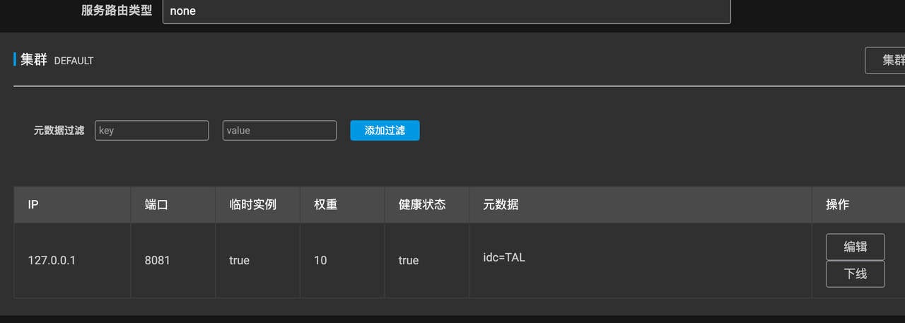
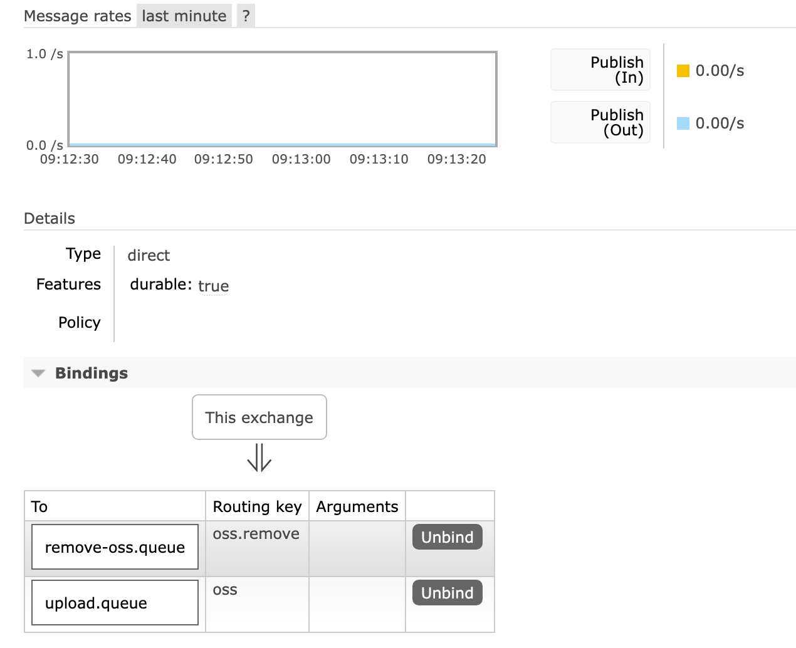
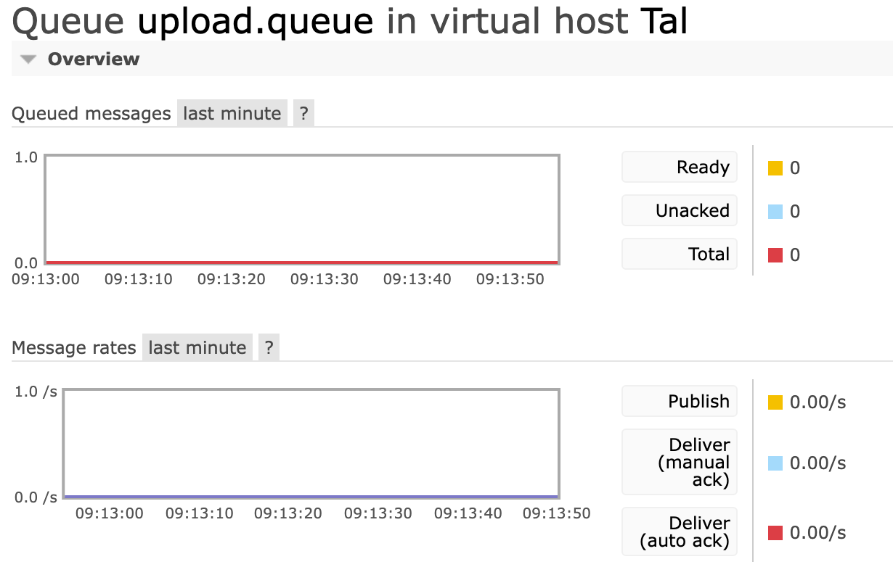
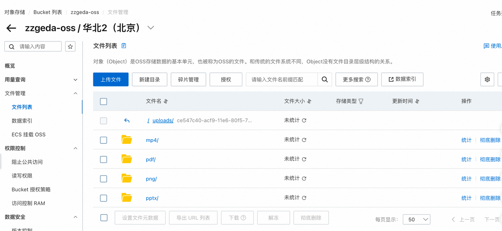
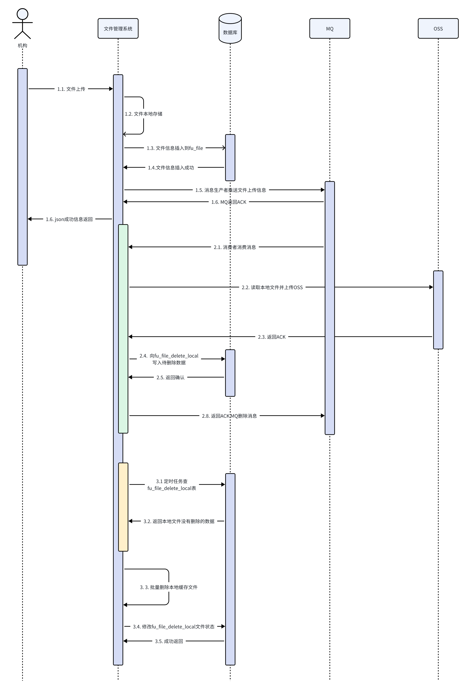
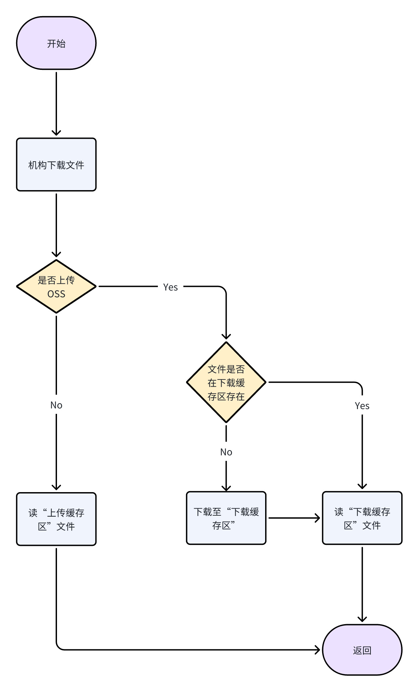
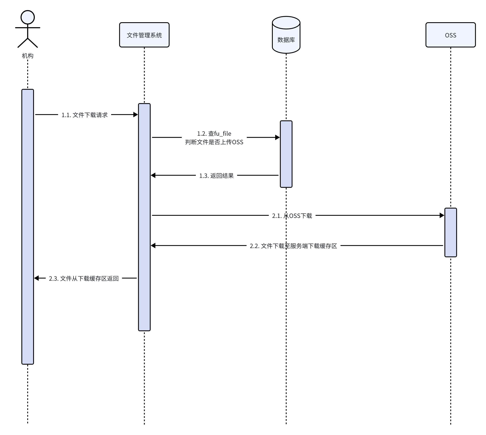
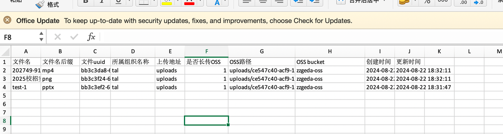

## 文件上传系统-DEMO

### 1. 项目需求

#### 1.1. 任务清单

> - 实现文件上传到七牛云（包含图片、视频、PPT等文件格式）✅
> - 获取文件的上传列表、分页、文件名称搜索、列表导出、删除、重命名 ✅
> - 支持批量文件上传，秒传 ✅
> - 把创建的数据实时同步到Elasticsearch，支持切换到ES搜索 ❌
> - 支持文件下载、文件列表导出 ✅
> - 附加题：可以切换到nacos读取配置（比如Mysql、Es等本地配置）✅

#### 1.2. 需求描述

> - 面向对象：使用魔法校的机构
> - 业务场景：机构需要将自己的文件资源上传到云盘（教研云），
> 文件格式需支持word、pdf、csv、excel、ppt、mp4等多种文件格式。同时允许机构在前端展示页面查询文件信息（文件名、更新时间），更新文件信息，删除文件，批量导出文件信息。在此之上允许机构单个\批量上传文件，单个\批量下载文件。
> - 业务挑战：
>   1. 文件上传\下载：
>   2. 支持文件批量上传和下载
>   3. 支持文件批量秒传
>   4. 文件上传异步存储到OSS
>   5. 中间件：
>   6. 使用Go SDK完成Mq、OSS、Nacos、Mysql操作
>   7. 在服务器和本地搭建中间件运行环境
### 2. 项目架构
#### 2.1. 系统设计
> 
#### 2.2 层级设计
 ```
├── bin
├── cache.                          // Nacos 缓存
├── downloads                       // OSS文件下载（下载缓存）
├── excel                           // 文件列表导出excel
├── go.mod                          // go的包管理
├── go.sum
├── logs                            // 日志记录文件
│   ├── nacos                      // nacos运行日志
│   └── project                    // 项目运行日志
├── main.go                         // 项目启动文件
├── src
│   ├── config                     // 项目配置文件
│   ├── controller                 // 路由控制器
│   ├── entity                     // 实体对象
│   │   ├── bo                    // 数据库对象（业务对象）
│   │   ├── dto                   // 服务传输对象
│   │   └── vo                    // 前端返回对象
│   ├── es                         // es
│   ├── global                     // 全局变量
│   │   ├── enum
│   │   └── parameter.go
│   ├── mapper                     // 数据库操作业务层
│   ├── middleWare                 // 中间件
│   ├── mq                         // mq操作层
│   │   ├── consumer.go
│   │   ├── messageTransform.go
│   │   ├── producer.go
│   │   ├── rabbitMqServer.go
│   │   └── service               // mq操作业务层
│   │       ├── fileUploadOssConsumer.go
│   │       └── initConsumerService.go
│   ├── oss                        // oss层
│   ├── service                    // 核心业务层
│   ├── test                       // 业务测试层
│   ├── timingTask                 // 定时任务层
│   └── utils                      // 公共方法层
│       ├── process
│       └── resp
├── templates
│   └── uploadFrontEnd.html
└── uploads                        // 文件上传本地缓存层
```

#### 2.3. 数据库结构

##### 2.3.1 组织表：用于存储组织信息（组织UUID、组织名称等）
```sql
-- auto-generated definition
create table fu_organization
(
    id          bigint auto_increment comment '自增id'
        primary key,
    org_uuid    varchar(64)  default ''                not null comment '组织唯一id',
    org_name    varchar(255) default ''                not null comment '组织名称',
    org_path    varchar(64)  default ''                not null comment '组织文件存储路径',
    create_time datetime     default CURRENT_TIMESTAMP not null comment '创建时间',
    update_time datetime     default CURRENT_TIMESTAMP not null comment '更新时间',
    is_deleted  tinyint      default 0                 not null comment '是否删除 0 没有 1 有',
    constraint fu_organization_unique_uuid
        unique (org_uuid)
)
    comment 'fileUpload的组织信息';
```

##### 2.3.2 文件表：用于存储文件信息（OSS路径、文件UUID、文件后缀等）
```sql
-- auto-generated definition
create table fu_file
(
    id                 bigint auto_increment comment 'id'
        primary key,
    file_uuid          varchar(64)  default '' null comment '文件唯一uuid',
    file_original_name varchar(64)  default ''                not null comment '文件名',
    file_suffix        varchar(32)  default ''                not null comment '文件名后缀',
    local_group        varchar(128) default ''                not null comment '本地存放地址的最大区域',
    if_upload_oss      tinyint      default 0                 not null comment '是否上传oss: 0 没有上传 1上传',
    org_id             bigint       default 0                 not null comment 'file文件所属的机构',
    oss_path           varchar(512) default ''                not null comment 'oss路径的存放地址',
    create_time        datetime     default CURRENT_TIMESTAMP not null comment '创建时间',
    update_time        datetime     default CURRENT_TIMESTAMP not null comment '创建时间',
    is_deleted         tinyint      default 0                 not null comment '是否删除 0不是 1 是',
    oss_bucket         varchar(128) default ''                not null comment 'oss_bucket',
    constraint fu_file_uuid
        unique (file_uuid)
) comment '文件信息';
```
#####  2.3.3 待删除本地文件表：定时任务删除本地文件所需的表（文件UUID、文件是否删除的判断字段）
```sql
-- auto-generated definition
create table fu_file_delete_local
(
    id                  bigint auto_increment comment 'id'
        primary key,
    file_delete_uuid    varchar(64) default ''                not null comment '删除文件记录唯一id',
    file_uuid           varchar(64) default ''                not null comment '文件uuid',
    upload_file_deleted tinyint     default 0                 null comment '上传文件是否删除 0未删除 1 删除了',
    create_time         datetime    default CURRENT_TIMESTAMP not null comment '创建时间',
    update_time         datetime    default CURRENT_TIMESTAMP null comment '更新时间',
    is_deleted          tinyint     default 0                 not null comment '是否删除 0不是 1 是',
    constraint fu_dele_local_file_unique
        unique (file_delete_uuid)
)
    comment '删除本地文件';
```

#### 2.4. 中间件
##### 2.4.1. Nacos
> 使用Nacos实现动态配置拉取和服务发现。
> 文件管理系统在项目启动的时候用Nacos拉去项目配置，等待项目启动成功后将服务注册到Nacos中，允许其他服务访问。
> 
> 图1 动态配置中心

>  图2 服务发现中心
##### 2.4.2 Mq
> 本次项目使用RabbitMq完成项目开发；在tal虚拟机下使用direct模式根据routing key实现exchange路由器到消息队列的消息转发。
> 使用Mq的目的是以异步的形式上传OSS。
> 
> 图3 Exchange路由
>  
> 图4 Queue 消息队列

##### 2.4.3 OSS
> 使用阿里云OSS对象存储中心，将本地文件（机构上传的文件）上传至OSS，同时支持文件从OSS下载至本地返回给前端。
>

### 3. 需求实现
#### 3.1. 文件上传
##### 3.1.1. 业务逻辑
> 文件上传由三部分组成：
> 1. 用户将文件上传至服务端，文件存储在服务端“上传缓存区”，同步向前端返回确认码
> 2. 文件上传至服务端之后异步推送消息至MQ，等待消费者消费。
>    1. 消费者消费消息，并将文件推送至OSS
>    2. 文件成功推送至OSS之后，向fu_file_delete_local插入待删除的数据
> 3. 定时任务开启，每晚凌晨执行服务端缓存文件的批量删除操作
>   1. 从fu_file_delete_local查upload_file_deleted为0的记录
>   2. 然后批量将文件删除
>   3. 最后修改upload_file_deleted状态
##### 3.1.2. 业务设计的原因
> 1. 文件上传至OSS是耗时业务，业务响应时间应遵循“三秒原则”，所以使用MQ异步将文件上传至OSS
> 2. MQ传递文件UUID，和文件在服务端的存放地址，等待消费者消费之后读本地文件然后上传
> 3. 启用定时任务删除服务端缓存文件目的是解决文件删除时用户同时读文件的场景。
>    1. 业务逻辑见3.2 文件下载
>    2. 文件删除最好在业务不繁忙时期删除
##### 3.1.3. 业务时序图
> 

#### 3.2 文件下载
##### 3.2.1 业务逻辑
###### 文件下载逻辑：
> 1. 优先判断文件是否上传OSS，如果是则从OSS下载文件，如果不是则从上传文件处的缓存区域下载
> 2. 如果文件上传OSS，则优先从服务端下载处的缓存区下载
> 3. 缓存区：
>   1. uploads/ ===> 上传文件缓存区
>   2. downloads/ ===> 下载文件缓存区 
###### 文件下载注意事项⚠️⚠️⚠️：
> 1. 文件下载其实是一个读文件的过程，当文件在读的过程如果文件同时删除，那么将会报错，为此需要单独处理。
> 2. 由于异步文件上传到OSS是一个耗时业务，受MQ中的数据量、服务端网络影响。所以当文件上传到服务端“上传文件缓存区之后”之后，需要等待一段时间才能上传到OSS。如果此时有用户想下载文件的话，就必须从“上传文件缓存区”下载。
>    1. 所以在上面这个情况下，如果上传文件到OSS直接删除“上传文件缓存区”文件的话，非常容易报错（当然我们可以设置等待机制，或者遇到报错将Mq消息重新发送到队列，但这样我们的代码量就增加了，侵入式代码就会增加），所以就考虑使用定时任务，在牺牲存储空间的情况下，减少我们的侵入代码。
> 3. 需要注意⚠️：定时任务删除“上传文件缓存区”文件时仍然需要加锁🔒，解决读文件时报错的情况。锁机制可以使用redis实现。
##### 3.2.2 业务流程图
> 
##### 3.2.3 业务时序图
> 

#### 3.3. 文件列表查询、更新和删除
##### 3.3.1 文件列表查询
> 1. 业务逻辑：文件信息查询使用分页查询，返回文件列表的分页数据。
> 2. 查询逻辑：针对文件只支持单文件名查询，不支持多文件查询 ⚠️
##### 3.3.2 文件更新
> 1. 业务逻辑：文件列表展示处支持文件名更新
> 2. 更新逻辑：当接口调用直接更新文件名
##### 3.3.3 文件删除
> 1. 业务逻辑：文件删除时优先删除本地“上传缓存区”文件，然后删除OSS文件，最后修改数据库字段
> 2. 注意细节：针对文件上传至“上传缓存区”，但是还没有上传到OSS的文件，我们直接返回“请稍后重试”。后期针对这个场景添加消息队列做删除操作

#### 3.4. 文件列表导出
> 1. 业务逻辑：针对文件列表导出，允许用户勾选文件信息然后完成批量文件信息的下载。下载格式为Excel。下载详情包括：文件名、文件名后缀
> 2. 下载结果：
> 

#### 3.5. 文件批量上传和批量导出
##### 3.5.1 业务逻辑
> 1. 批量处理核心逻辑：针对批量处理使用go func处理，同时开辟channel接受协程处理的返回结果，最终等待所有协程处理完毕返回结果。
> 2. 批量上传：对于批量上传接口，针对form表单使用MultipartForm关键字获取表单的批量文件信息
> 3. 使用协程的原因：
>    1. 充分利用CPU核心数资源，使用比线程轻量的协程完成并发操作。
>    2. 在此基础上实现文件的批量导入、秒传、批量下载
### 4. 云存储解决方案
#### 4.1. 单文件上传解决方案

> 磁盘结构划分
> ~/                                           本地文件根目录
> ～/organziationId/                     拼接机构ID
> ～/organziationId/suffix              拼接文件名后缀
> ～/organziationId/suffix/fileId     拼接文件ID    
#### 4.2. 具体实现
> 增设单文件上传接口：/uploadFile/singleFile
> 前端通过form表单（使用multipart/form-data编码）将文件上传到后端
> 后端同步将文件存入本地磁盘，磁盘路径为 ～/organziationId/suffix/fileId  
> 同步并将文件存入的地址和文件信息存入MySQL中，并将ifUploadOSS设置为false
> 同步将机构ID+fileId输入到Mq中，等待消费者消费，异步读文件并上传到OSS上
> 返回机构ID和file id
>消息队列的消息消费者，进行异步处理
> 读取队列中的文件ID，并通过查表读取到准确的文件地址
> 通过地址读取文件，然后将文件内容上传入OSS
> 在当前消费者线程中同步将fileID信息插入到delet_file表中，等待定时任务执行将本地文件删除
> 等待操作全部执行成功，向Mq返回ACK，将消息从MQ中移除
> 执行定时任务，从delete_file表中读出需要删除的文件数据
> 每天晚上凌晨执行，根据文件路径，将文件删除
> 
> * 注意⚠️⚠️⚠️⚠️⚠️：  
>>  ⚠️查询文件时读文件问题：  
> `场景` ：如果文件在读的时候，文件同时在删除  
> `解决1` ：对文件ID加读写锁🔒，当文件在读的时候不允许删除，追加入等待队列，等待其他文件删除操作执行完毕重新删除  
> `解决2`：文件读默认从OSS读，而不是从本地读，因为删除文件操作必须是文件上传OSS完后，所以从OSS读就不需要加锁🔒   
> `解决3`：当文件还没有上传OSS的时候，根据文件file表中 if_upload_oss 字段判断是否上传，如果没有上传那么就读本地，同样不要加锁🔒    
> 
> > ⚠️同名文件是否做唯一性校验：  
> > `场景`：用户先后上传两个文件名一致的文件，是否做校验  
> > `解决1`：不校验，允许前端显示同名文件  
> > `解决2`：没想好  
> 
>> ⚠️消息队异步处理策略：  
> 场景有可能报错的地方：读文件失败、OSS上传失败、delete_file插入失败  
> `解决1`，OSS上传失败：OSS上传失败则将消息重新推入消息队列，重新上传（一般是网络原因），DB持久化同步记录（兜底策略，网络完全失效）  
> `解决2`，delete_file失败，如果ID已经存在就不需要插入直接ACK，其他问题就返回队列  
> `解决3`，读文件失败：系统问题，重试5次，如果都不行，就进入死信队列，等待人工处理。  
> 或者在写文件这个地方多多个备份，在不同的磁盘区域做备份，如果多个地方都不行，再进入死信队列。其实文件是否成功删除的重要性比文件上传OSS的重要性低，只要文件能上传OSS业务就是正常的  
